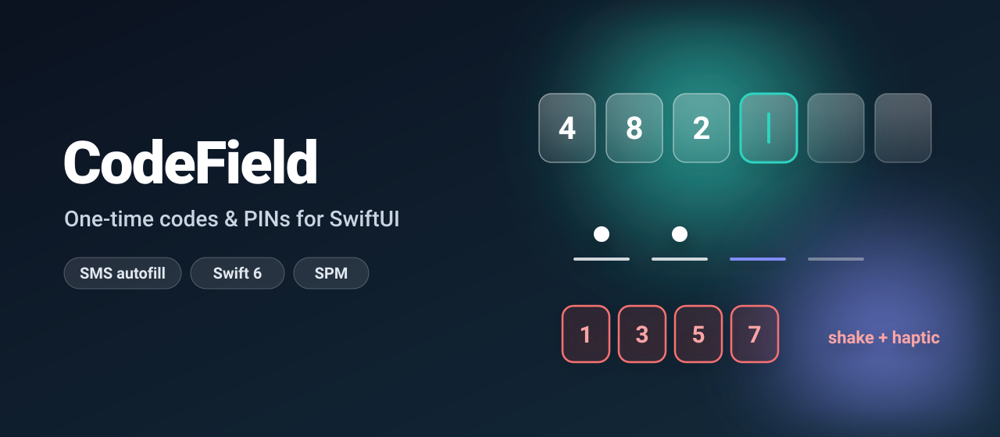
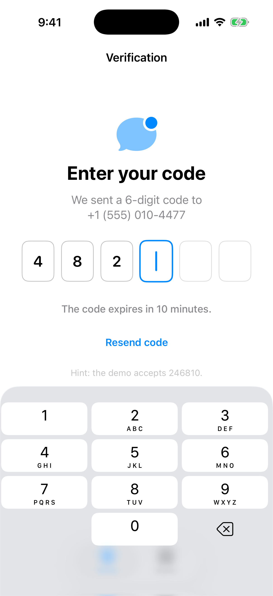
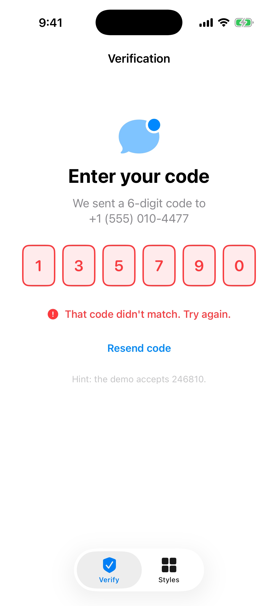
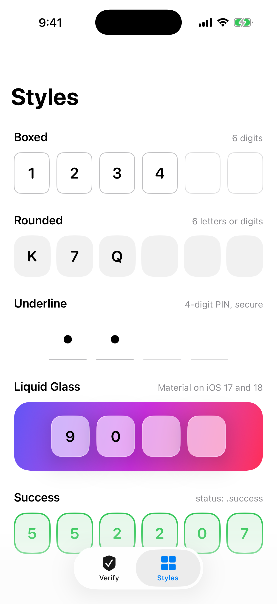
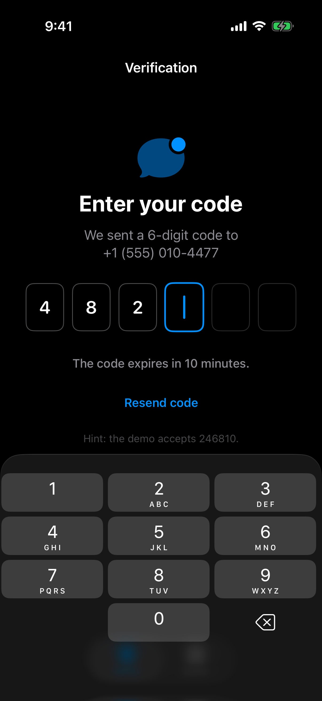
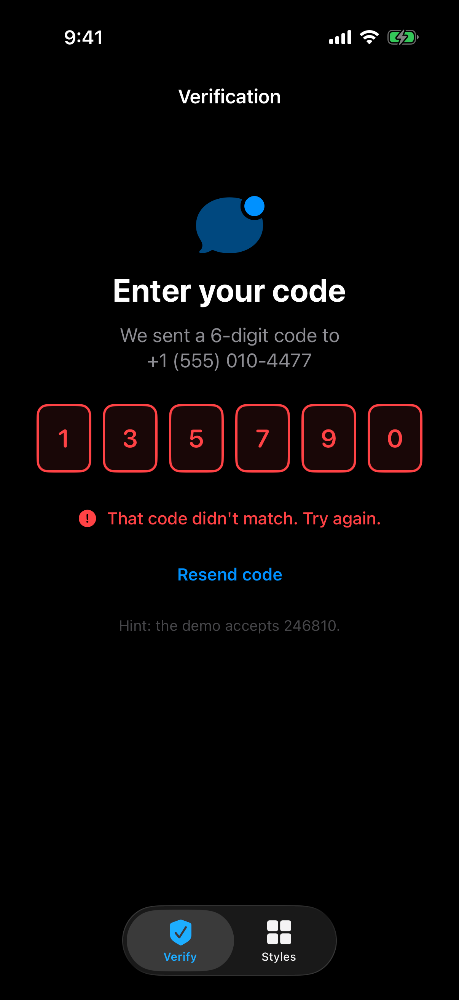
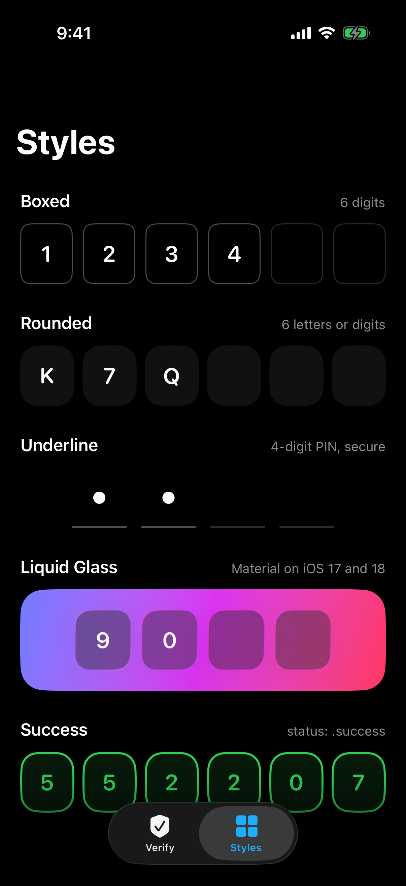

<p align="center">
  
</p>

<p align="center">
  <a href="https://github.com/halilozel1903/CodeField/actions/workflows/ci.yml"></a>
  
  
  
  
  <a href="LICENSE"></a>
</p>

**CodeField** is a polished, dependency-free SwiftUI input for one-time codes and PINs: SMS autofill, paste of a whole message, backspace across boxes, secure dots, four box styles including **iOS 26 Liquid Glass**, and error and success states with a shake and haptics.

```swift
CodeField($code, length: 6) { code in
    verify(code)
}
```

## Screenshots

Captured from the example app on an iOS 26 simulator by CI.

| Verification | Error state | Styles |
| :---: | :---: | :---: |
|  |  |  |
|  |  |  |

## Features

- 🔢 **4 to 8 boxes**, digits (number pad) or letters and digits (uppercased).
- 📩 **SMS autofill** with `.textContentType(.oneTimeCode)`: the code from Messages appears above the keyboard.
- 📋 **Smart paste**: `"Your code is 482-913."` fills all six boxes; grouped codes like `123 456` are joined, and other scripts' digits (`１２３`, `١٢٣`) are converted.
- ⌫ **Backspace across boxes**, one character at a time, with the caret following along.
- 🔒 **Secure mode** shows dots instead of characters, for PINs.
- 🎨 **Styles**: `.boxed`, `.underline`, `.rounded` and `.glass` (Liquid Glass on iOS 26 / macOS 26, material fallback before).
- ▍ **Animated caret** and springy character transitions.
- ❌ **Error state** with a shake and an error haptic; ✅ **success state** with a success haptic.
- ♿️ **Accessible**: one VoiceOver element that reads how many characters were entered, never the code.
- 🧵 **Swift 6 strict concurrency**, zero dependencies.
- 🧪 **Tested** with Swift Testing; all input logic lives in `CodeInput`, a pure value type you can reuse.

## Installation

### Swift Package Manager

In Xcode choose **File › Add Package Dependencies…** and enter:

```
https://github.com/halilozel1903/CodeField
```

Or add it to `Package.swift`:

```swift
dependencies: [
    .package(url: "https://github.com/halilozel1903/CodeField", from: "1.0.0")
]
```

## Quick start

```swift
import CodeField
import SwiftUI

struct VerifyView: View {
    @State private var code = ""
    @State private var status: CodeFieldStatus = .idle

    var body: some View {
        CodeField($code, length: 6, status: status, autofocus: true) { code in
            Task {
                status = await api.verify(code) ? .success : .error
            }
        }
        .disabled(status == .success)
        .onChange(of: code) {
            if status == .error { status = .idle }   // start over after a mistake
        }
    }
}
```

`onComplete` is called once each time the last box gets filled, whether the code was typed, pasted or autofilled.

## Usage

### Options

```swift
CodeField(
    $code,
    length: 6,                   // 4...8, clamped
    characterSet: .digits,       // or .alphanumeric
    style: .boxed,               // .underline, .rounded, .glass
    isSecure: false,             // dots instead of characters
    status: .idle,               // .error, .success
    autofocus: false,            // focus and show the keyboard on appear
    onComplete: { code in }
)
```

### Styles

| Style | Look | On iOS 17 – 18 |
| --- | --- | --- |
| `.boxed` | Outlined boxes with rounded corners | Same |
| `.underline` | A line under each character | Same |
| `.rounded` | Filled, generously rounded tiles | Same |
| `.glass` | `glassEffect(.regular.interactive())` tiles | `.ultraThinMaterial` + hairline border |

The focused box and the caret use the view's `tint`:

```swift
CodeField($pin, length: 4, style: .underline, isSecure: true)
    .tint(.indigo)
```

### Error and success

Set `status` from your verification logic. Changing it to `.error` shakes the boxes (skipped when *Reduce Motion* is on) and plays `SensoryFeedback.error`; `.success` turns them green and plays `.success`. VoiceOver appends "incorrect code" or "code accepted" to the field's value.

### Use the logic on its own

`CodeInput` has no SwiftUI dependency, so you can reuse it with UIKit, AppKit or your own views:

```swift
var input = CodeInput(length: 6)
input.replace(with: "7")                                   // typed a digit
input.replace(with: "7482913")                             // tapped the SMS suggestion
input.value                                                // "482913"
input.isComplete                                           // true

CodeInput.extractCode(from: "Use AB12CD to sign in", length: 6, characterSet: .alphanumeric)  // "AB12CD"
CodeInput.sanitize("１２-3", characterSet: .digits)         // "123"
input.slots                                                // [.filled("4"), …]
input.accessibilityValue                                   // "6 of 6 digits entered"
```

## How it works

A single invisible `TextField` owns the keyboard, autofill, paste and backspace, so the system behaves exactly as users expect. Every change goes through `CodeInput.replace(with:)`, which filters, normalizes, clamps and recognizes full codes arriving at once. The boxes are drawn from `CodeInput.slots`.

## Example app

The `Example` folder contains a demo app with a verification screen (the demo accepts `246810`) and a gallery of every style. It uses [XcodeGen](https://github.com/yonaskolb/XcodeGen) so no project file has to live in the repo:

```bash
brew install xcodegen
cd Example && xcodegen generate
open CodeFieldDemo.xcodeproj
```

## Requirements

- Xcode 26 or later (Swift 6.2 toolchain)
- iOS 17+ / macOS 14+ (Liquid Glass automatically on 26+)

## Contributing

Issues and pull requests are welcome. Please run `swift test` before opening a PR.

## License

CodeField is available under the MIT license. See [LICENSE](LICENSE).
